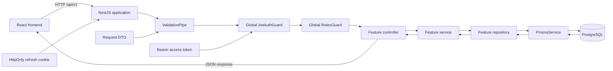
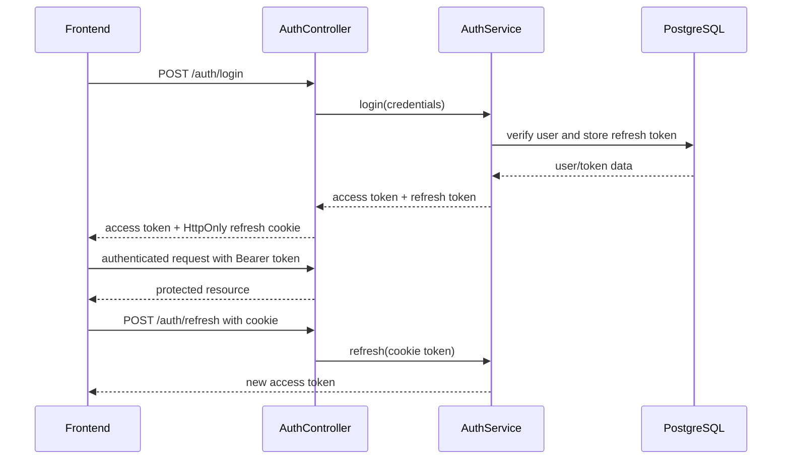
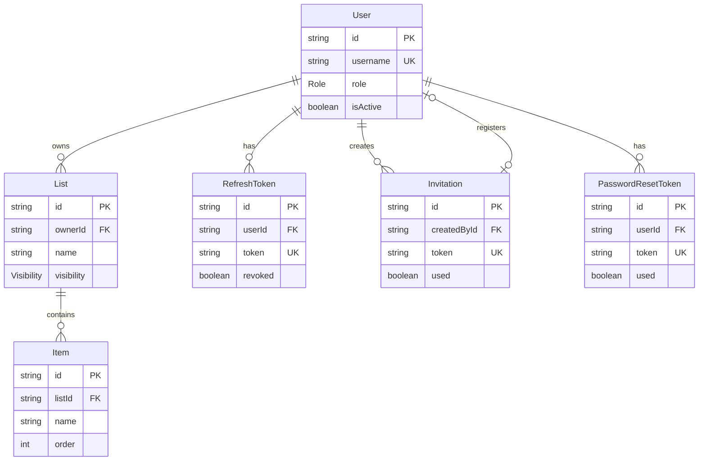

# Backend Architecture

## Source Structure

```text
backend/
├── app.js                    # Production entry point for Passenger
├── prisma/
│   ├── schema.prisma         # PostgreSQL models and relationships
│   └── migrations/           # Committed database migrations
└── src/
    ├── main.ts               # Creates and configures the NestJS application
    ├── app.module.ts         # Composes feature and infrastructure modules
    ├── auth/                 # Login, tokens, JWT strategies, and global guards
    ├── users/                # User operations
    ├── invitations/          # Registration invitation lifecycle
    ├── lists/                # Gift-list operations and access rules
    ├── items/                # Items contained by lists
    ├── prisma/               # Shared Prisma database client
    └── common/decorators/    # Public, role, and current-user metadata
```

## Application Bootstrap

```text
createApp
  NestFactory.create(AppModule)
  set prefix /api/v1
  register global ValidationPipe
  register cookie parser
  enable credentialed CORS
  return configured application

local development
  main.ts -> bootstrap -> app.listen(PORT or 3001)

production on HelioHost
  Passenger -> app.js -> dist/main.createApp -> app.listen(PORT)
```

The validation pipe removes unknown DTO fields, rejects non-whitelisted fields, and transforms incoming values. `ServeStaticModule` serves the compiled React application from `backend/public` while excluding `/api/v1`.

## Modules

```text
AppModule
├── ConfigModule             # Global environment configuration
├── ServeStaticModule        # Compiled frontend and SPA fallback
├── PrismaModule             # Shared PostgreSQL connection
├── AuthModule               # Authentication and global guards
├── UsersModule
├── InvitationsModule
├── ListsModule
├── ItemsModule
└── HealthController         # GET /api/v1/health
```

Feature modules generally follow this separation:

```text
Controller
  receives HTTP input and selects the current user
Service
  applies business rules and authorization checks
Repository
  defines Prisma queries and persistence operations
DTO
  validates request payloads
```

## Request Data Flow



For example, loading one list follows:

```text
GET /api/v1/lists/:id
  ValidationPipe
  JwtAuthGuard
    JwtStrategy validates bearer token
    request.user is populated
  RolesGuard
  ListsController.findOne
    ListsService.findById
      reject missing list
      reject private list owned by another user
      ListsRepository.findById
        PrismaService.list.findUnique
          PostgreSQL
```

Creating a list follows:

```text
POST /api/v1/lists
  validate CreateListDto
  authenticate current user
  ListsController.create
    ListsService.create
      default visibility to PRIVATE
      connect list to current user
    ListsRepository.create
      PrismaService.list.create
  return 201 Created
```

## Authentication Flow



Authentication is protected by default:

```text
JwtAuthGuard (global)
  if endpoint has @Public()
    allow request without an access token
  otherwise
    validate JWT and populate request.user

RolesGuard (global)
  if endpoint has no @Roles(...)
    allow authenticated request
  otherwise
    require request.user.role to match
```

Public endpoints are marked deliberately with `@Public()`, including login, registration, token refresh, and password-reset operations.

## Database Relationships



Deleting a list cascades to its items. Deleting a user cascades to password-reset tokens; other user relationships use the database behavior defined by their Prisma relations.
