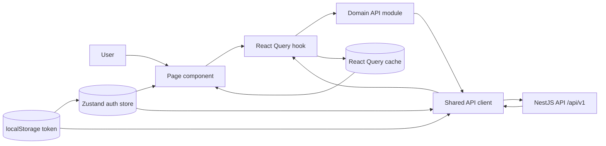

# Frontend Architecture

## Source Structure

```text
frontend/src/
├── main.tsx              # Mounts React, Router, and React Query
├── App.tsx               # Declares routes and access boundaries
├── pages/                # Complete screens
│   ├── auth/             # Login, registration, and password reset
│   ├── lists/            # Lists, items, and friends
│   └── admin/            # Administration
├── components/
│   ├── layout/           # Navigation, layouts, and route guards
│   └── ui/               # Reusable Button, Input, Modal, and Badge
├── hooks/                # React Query queries and mutations
├── api/                  # Typed backend endpoints
├── store/                # Zustand authentication state
└── types/                # Shared TypeScript models
```

## Application Shell

```tsx
<React.StrictMode>                       // main.tsx
  <QueryClientProvider>                  // server data and cache
    <BrowserRouter>                      // URL navigation
      <App>                              // route definitions
        <Suspense>                       // lazy page loading
```

## Routes

```text
Public
├── /login
├── /register
└── /reset-password

RequireAuth
└── AppLayout
    ├── Navbar
    ├── /listas
    ├── /listas/:id
    ├── /amigos
    ├── /amigos/:userId/listas
    └── RequireAdmin
        └── /admin

/ or unknown URL
└── redirect to /listas
```

Pages are loaded lazily, so each screen's JavaScript is downloaded when needed.

## Data Flow



Loading the current user's lists follows this path:

```text
ListsPage
  useMyLists
    React Query: ["lists", "mine"]
      listsApi.findMine
        api.get("/lists")
          fetch("/api/v1/lists")
```

Creating a list follows this path:

```text
ListsPage.handleCrear
  useCreateList().mutate(formData)
    listsApi.create(formData)
      POST /api/v1/lists
    invalidate ["lists", "mine"]
      refetch lists
      rerender ListsPage
```

## State Ownership

```text
Local component state
└── modal visibility and form values

Zustand
└── current user and access token

localStorage
└── persistent access token

React Query
└── lists, users, account data, loading/error state, and cache
```

## Authentication Guard

```text
RequireAuth
  read token from Zustand
  if token is missing
    redirect to /login
  fetch current user with useMe
  if loading
    show loading state
  if user is invalid
    redirect to /login
  synchronize user into Zustand
  render protected route
```
